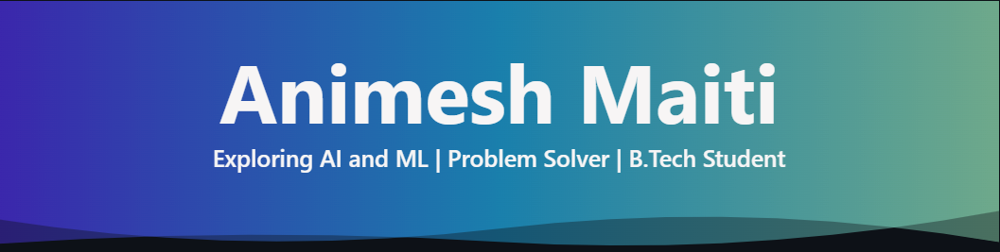

  <!-- Perfect, unbreakable banner loaded directly from your repository -->
  

    
  <h3><b>Building solutions and exploring the frontiers of new technologies 🚀✨</b></h3>
   

  <!-- Social Badges & Profiles -->
  
  
  
  
  

 

## About Me

### 👋 Hey there!

I'm Animesh, a Computer Science student who enjoys building intelligent software, optimizing data structures, and exploring machine learning. I believe the best way to master new technologies is by diving headfirst into real-world applications and coding projects.

<table width="100%" style="border: none;">
  <tr>
    <td width="55%" valign="top">
      <pre><code>
┌──────────────────────────────────────────┐
│            DEVELOPER PROFILE             │
└──────────────────────────────────────────┘

 name      : Animesh Maiti
 location  : Kolkata, India
 role      : AI/ML Learner & Problem Solver
 education : B.Tech – Computer Science (AI-ML)

 focus:
  ▸ 🤖 Machine Learning Basics
  ▸ 🧠 Natural Language Processing
  ▸ ⚔️ Data Structures & Algorithms
  ▸ 🛠️ Software Development

 currently:
  ▸ Building an NER model via BioBERT
  ▸ Exploring deep learning architectures
  ▸ Mastering problem-solving skills
  ▸ Creating an impactful portfolio

 motto : "Transforming raw data into 
          intelligent connections."
      </code></pre>
    </td>
    <td width="45%" align="center" valign="middle">
      <!-- Coder image placed perfectly next to your terminal profile -->
      
    </td>
  </tr>
</table>

---

## 💻 Coding Profiles

   
  
   

---

## 🛠️ Tech Arsenal

   
  <h3>Languages</h3>
  

    
  

  <h3>AI, ML & Data Science</h3>
  

    
    
    
    
  

  <h3>Frameworks & Libraries</h3>
  

    
  

  <h3>Databases</h3>
  

    
  

  <h3>Tools & Platforms</h3>
  

    
  

   

---

## 📌 Featured Projects

  <!-- Top 2 Projects -->
  
  
    
  <!-- 3rd Project Centered -->
  
    
  
<i>⭐ Exploring the intersection of data models, automation, and practical software.</i>

---

## 📊 GitHub Analytics

  
  

 

  

 

  

